# UFC Analytics Dashboard


Ce dépôt contient le code d'un tableau de bord interactif construit à l'aide de Dash, un cadre d'application web Python. Le tableau de bord fournit des informations et des analyses sur l'Ultimate Fighting Championship (UFC) entre 1993 et 2020. Les utilisateurs peuvent explorer diverses visualisations et données relatives aux matchs de l'UFC, aux combattants, etc.


# Table des Matières
- [Guide Développeur](#guide-développeur)
- [Guide Utilisateur](#guide-utilisateur)
- [Rapport d'Analyse](#rapport-danalyse)


# Guide Utilisateur

Installation

Clonez le dépôt dans votre machine local

```bash
git clone https://git.esiee.fr/renaulta/ufctestpython.git
```
Rendez vous dans le répertoire du projet

```bash
cd ufctestpython
```
```bash
cd assets
```
Installez les packages nécessaires


```bash
pip install -r requirements.txt
```

Lancez l'application 
```bash
python main.py
```
Entrez cette Url dans votre naviguateur préferé. 
```bash
http;//0.0.0.0/8007/
```
##
## Note Utilisation : 
L'utilisateur peut parcourir les diverses pages de l'application à travers ces liens : 

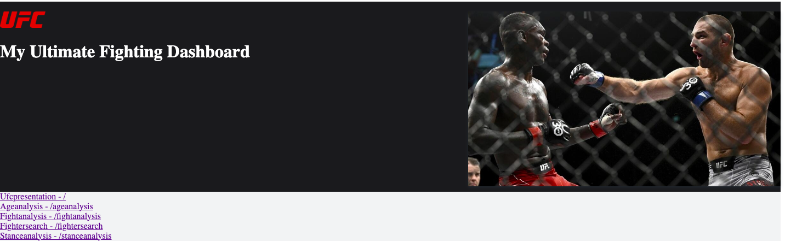

# Guide Développeur

Language : python

FrameWork : Dash plotly

IDE recommandé : Vscode 

## Architecture du code


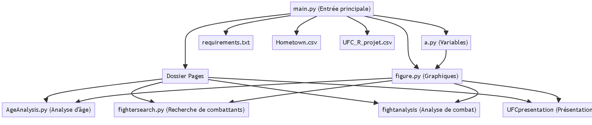


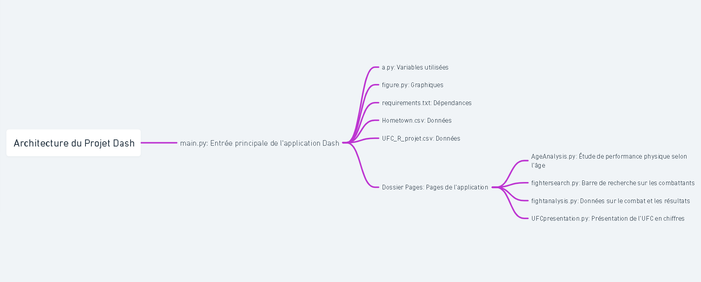


### Racine du Projet

main.py : Fichier principal servant de point d'entrée à l'application Dash. Il orchestre les interactions entre les différents composants de l'application.

a.py : Ce fichier contient l'ensemble des variables utilisées à travers les différents modules de l'application.

figure.py : Dédié à la création des graphiques, ce script gère la visualisation des données.

requirements.txt : Liste toutes les dépendances et les bibliothèques nécessaires pour exécuter l'application.

Hometown.csv : Fichier de données contenant des informations spécifiques utilisées par l'application.

UFC_R_projet.csv : Autre fichier de données essentiel pour le fonctionnement de l'application.

### Dossier Pages

Ce dossier contient les pages individuelles de l'application, chacune ayant une fonctionnalité spécifique :

AgeAnalysis.py : Analyse et présente les performances physiques des individus en fonction de leur âge.

fightersearch.py : Intègre une barre de recherche permettant de trouver des informations sur les combattants.

fightanalysis : Fournit des données détaillées sur les combats, incluant les résultats et les statistiques clés.

UFCpresentation : Présente l'UFC à travers des données chiffrées, offrant une vue d'ensemble informative.


## Qu'est-ce que l'UFC ?


### Ultimate Fighting Championships : 
L'Ultimate Fighting Championship, communément appelé l'UFC, est la plus grande organisation mondiale de combat libre (Mixed Martial Arts, MMA). Fondée en 1993, l'UFC a radicalement transformé le paysage des sports de combat en offrant une plateforme où les combattants de différentes disciplines martiales peuvent se mesurer dans un environnement sans restriction.

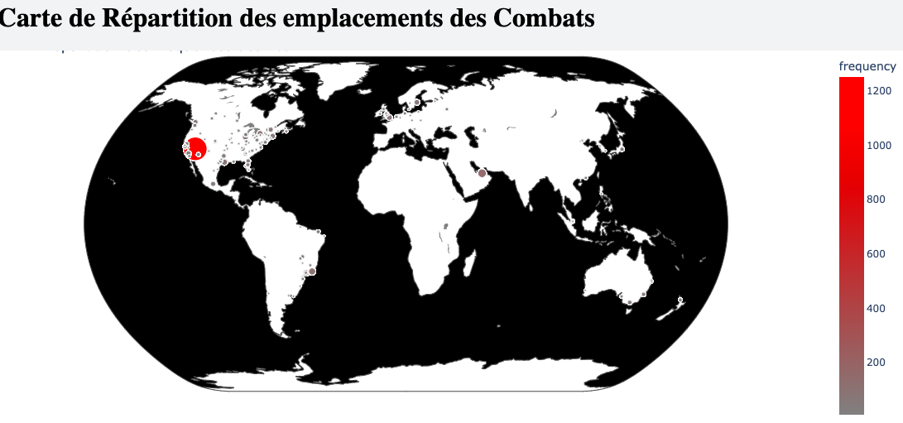

La carte ci-jointe illustre la distribution géographique des événements UFC à travers le monde. Il est notable que la majorité de ces événements se concentre sur le continent américain, reflétant les origines de l'organisation. En Europe, en revanche, le nombre d'événements organisés reste limité, probablement en raison des restrictions passées sur ce sport, perçu comme excessivement violent pendant de nombreuses années.

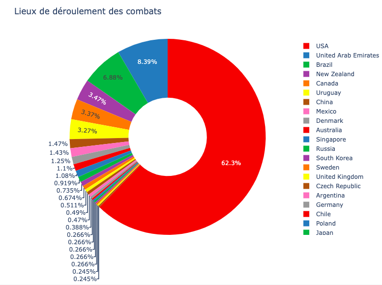

Ce diagramme offre une vision précise de la répartition des événements UFC par pays. Il permet d'identifier clairement les nations où le plus grand nombre d'événements a été organisé, mettant en lumière les zones géographiques privilégiées par l'UFC pour ses compétitions.


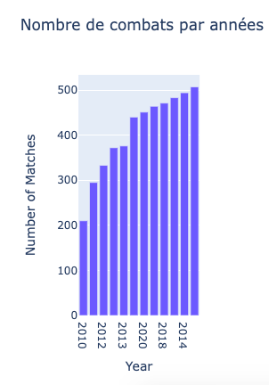

L'UFC un groupe en plein essor : 
Cet histogramme illustre clairement l'augmentation du nombre de combats organisés par l'UFC au fil du temps. Cette tendance ascendante témoigne de la croissance de la popularité de cette organisation, soulignant son succès croissant dans le monde des sports de combat.

Le poids, important lors d'un combat est délimité en catégories pour chaques combattants. Ainsi on distingue : 

Poids Mouche (Flyweight)
Limite de Poids: 56.7 kg (125 lb)
Description: La catégorie des poids mouches est la plus légère de l'UFC. Les combattants de cette catégorie sont agiles et rapides, offrant des combats dynamiques avec des techniques de frappe et de soumission.

Poids Coq (Bantamweight)
Limite de Poids: 61.2 kg (135 lb)
Description: Les combattants de la catégorie des poids coqs sont rapides et techniques. Les combats de cette catégorie sont souvent caractérisés par une combinaison de puissance et d'agilité.

Poids Plume (Featherweight)
Limite de Poids: 65.8 kg (145 lb)
Description: La catégorie des poids plumes présente des combattants légers mais puissants. Les combats dans cette catégorie sont connus pour leur énergie et leur intensité.

Poids Léger (Lightweight)
Limite de Poids: 70.3 kg (155 lb)
Description: Les combattants légers offrent une combinaison de vitesse, de puissance et d'endurance. La catégorie des poids légers est l'une des plus populaires, avec des combats souvent spectaculaires.

Poids Mi-Moyen (Welterweight)
Limite de Poids: 77.1 kg (170 lb)
Description: Les combattants de la catégorie des poids mi-moyens sont polyvalents, offrant une combinaison de puissance et d'habiletés techniques. Cette catégorie est connue pour sa compétitivité intense.

Poids Moyen (Middleweight)
Limite de Poids: 83.9 kg (185 lb)
Description: Les poids moyens présentent des combattants puissants et techniques. Les combats dans cette catégorie sont souvent marqués par des compétences de frappe et de grappling de haut niveau.

Poids Lourd Léger (Light Heavyweight)
Limite de Poids: 93.0 kg (205 lb)
Description: Les combattants de la catégorie des poids lourds légers sont puissants et agiles. Cette catégorie combine la force des poids lourds avec la vitesse des catégories plus légères.

Poids Lourd (Heavyweight)
Limite de Poids: Pas de limite supérieure
Description: Les poids lourds sont les combattants les plus massifs de l'UFC. 
Avec aucune limite de poids supérieure, cette catégorie présente souvent des combats explosifs mettant en jeu une puissance phénoménale.

Chaque catégorie de poids offre une dynamique unique, créant une diversité d'approches stratégiques et de styles de combat au sein de l'UFC. Ces catégories permettent aux combattants de trouver la classe de poids qui correspond le mieux à leurs compétences physiques et techniques, assurant des compétitions équitables et passionnantes.


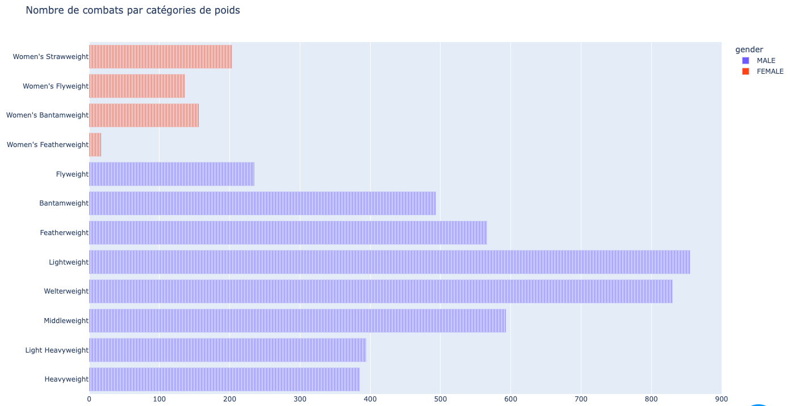

C'est exactement ce que l'on illustre ici. Notons  La distribution suit une courbe gaussienne, reflétant le fait qu'il y a un plus grand nombre de combattants de corpulence moyenne.

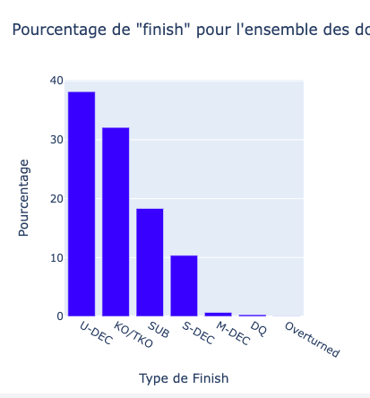


Les combats peuvent se conclurent de diverses manières : on parle de finish en faveur du corner Bleu ou Rouge : 

U-DEC (Unanimous Decision):
Description: Une décision unanime est rendue par les juges à la fin du combat. Cela signifie que tous les juges sont d'accord sur le vainqueur du combat.

KO/TKO (Knockout/Technical Knockout):
Description: Un combattant remporte le combat en mettant son adversaire KO (Knockout) ou en le forçant à abandonner en raison de l'incapacité de continuer (Technical Knockout).

SUB (Submission):
Description: La victoire est obtenue par soumission, c'est-à-dire qu'un combattant force son adversaire à abandonner en appliquant une prise de soumission.

S-DEC (Split Decision):
Description: Une décision partagée est rendue par les juges. Cela signifie qu'il y a un désaccord entre au moins deux des juges quant au vainqueur du combat.

M-DEC (Majority Decision):
Description: Une décision à la majorité est rendue par les juges. Cela signifie qu'une majorité des juges est d'accord sur le vainqueur, mais il peut y avoir un juge en désaccord.

DQ (Disqualification):
Description: Un combattant est disqualifié, entraînant la victoire de son adversaire. Cela peut être dû à des infractions graves aux règles ou à des comportements inappropriés pendant le combat.

Il est notable que la majorité des combats se terminent par une décision des juges, soulignant ainsi l'importance de la stratégie et de l'endurance dans ces affrontements.

Cet histogramme met en évidence les différentes manières de conclure un combat. Il est notable que la majorité des combats se terminent par une décision unanime des juges, soulignant ainsi l'importance de la stratégie et de l'endurance dans ces affrontements.Néanmoins notons que les KOset TKos arrivent en seconde position ce qui est considérable ! 

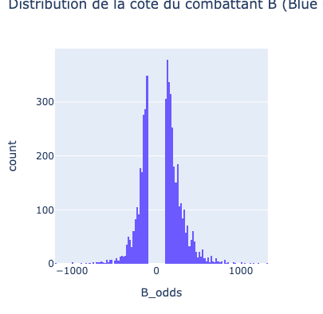


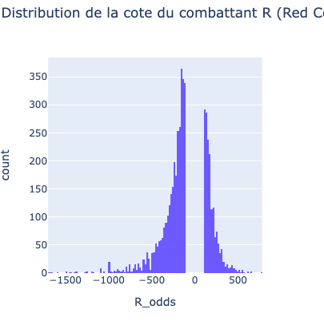

Notons que les spectateurs d'UFC parient généralement sur les combats. Par ailleurs en plus de parier sur les résultats il est possible de parier sur les finitions.On peut ainsi analyser la cote des différents corner et justifier que le maximum négatif étant du coté rouge qu'il s'agit du corner préferé du publique. Encore une fois le combattant rouge est souvent le champion ou ancien champion.

### Combats et Kos : 


Les combattants sont catégorisés par leurs de frappes significatives (le nombre de coups ayant touché leurs adversaires et ayant un impact.)
Il devient intéressant d'analyser la répartition moyenne de cette variable dans les différentes catégories.

Ces deux heatmaps fournissent des informations cruciales tant pour les catégories masculines que féminines. Il est observable que, dans les catégories de poids plus élevées, les combattants sont moins enclins à esquiver. Ainsi, dans ces catégories, la moyenne de coups significatifs portés est nettement supérieure à celle des catégories de poids léger.


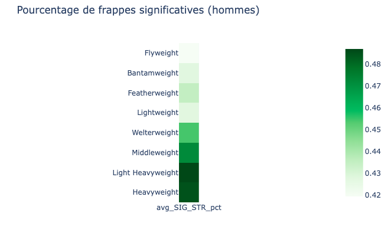

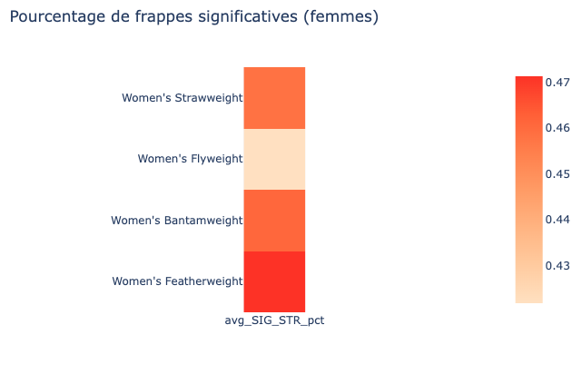 


Cet histogramme illustre le pourcentage de combats pour le titre se terminant par un 'finish'. Il est intéressant de noter que la majorité des combats pour la ceinture se concluent par un KO, contrairement aux matchs standards. 
Il est important de rappeler qu'un match de titre se déroule sur cinq rounds, tandis qu'un match normal en compte trois. Cette différence peut expliquer le taux élevé de KO, les combattants étant potentiellement plus épuisés lors des rounds supplémentaires.


Néanmoins cela est contraire à l'adage des fans d'UFC selon lesquels les champions préféreraient aller à la décision lors des combats pour la ceinture, par envie de jouer la "sécurité".

Bien au contraire ! Il s'avère que ce type de combat se termine le plus souvent par KO !  

Ici : la repartition des finitions si il s'agit d'un combat pour la ceinture : 

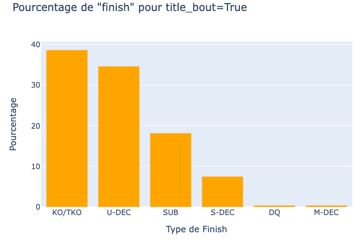


la repartition des finitions pour tout les combats : 


12


En parlant de KOs : 
Comment se déroulent-ils généralement ? 

Notons à l'aide de l'histogramme suivant que ceux-ci se ponctuent par des coups de poings : 


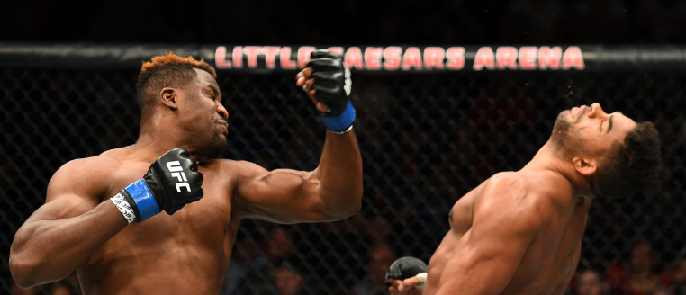


des coups de marteaux : 


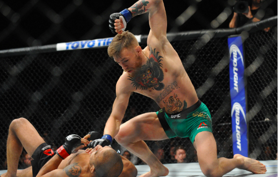

ou des rear naked choke : 


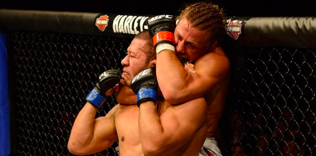

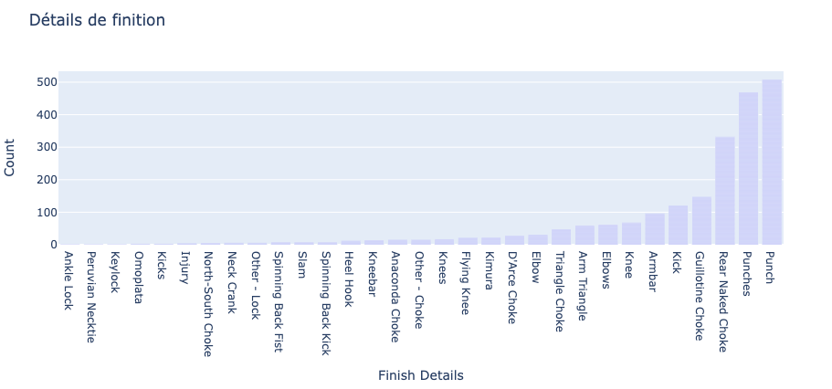

En grande majorité..


Par ailleurs, la finition par Ko étant clé pour la victoire d'un combat, à quel round  a-t-elle le plus souvent lieu ? 


Dès le 1er round ! 
Une explication résiderait dans le fait que les combattants soient le plus nerveux aux premiers rounds de leurs combats.

Ils sont alors plus adeptes de faire des erreurs !
Cependant, il est important de noter qu'une proportion considérable de KO se produit également au cours des deuxième et troisième rounds. 
La faible proportion de KO observée aux quatrième et cinquième rounds n'est pas particulièrement significative, étant donné que la plupart des combats se limitent à trois rounds.  

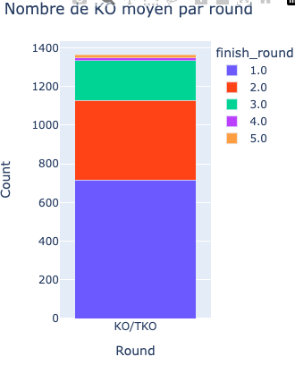

D'un oeil exterieur l'on penserait qu'un KO premier round est faiblement probable, et ce n'est pourtant pas le cas !
Si KO il peut y avoir, il y a de fortes chances que ce soit au premier round !


### Age et Performance Physique : 


Dans le monde des sports de combat, l'âge est au centre des préoccupations. 
Alors que certains professionnels du sport tiennent à préciser que cela ne se compare pas à l'expérience, il est utile de noter que les performances physiques des combattants sont intimement liées à leur âge. 
Ainsi, l'ensemble des techniques pouvant être liées à la victoire par décisions ou par KOs/TKOs a à voir de loin ou de près avec l'âge de nos combattants. 
On décide alors d'observer l'évolution de la moyenne des coups significatifs en fonction de l'âge de ceux-ci. On observe bel et bien une influence, le paramètre étant prédominant entre 25 et 30 ans. Si l'argument de "l'expérience" intervient lors du striking (combat pieds-poings).

Alors qu'en-est-il du wrestling(amené au sol) ? 

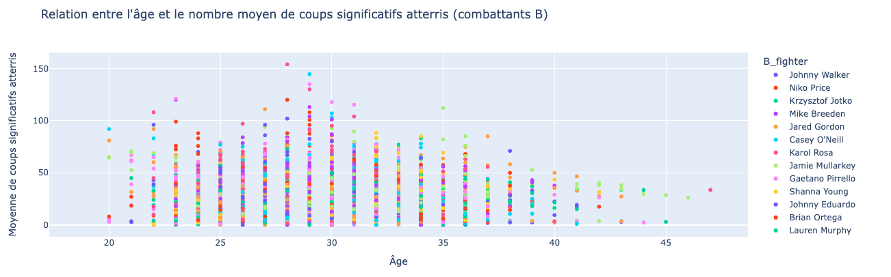

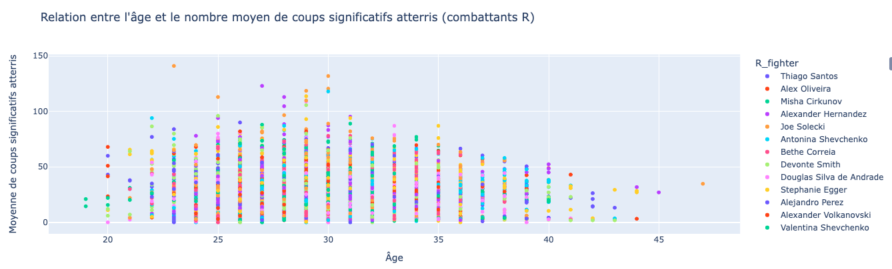

Grâce à l'analyse de ces deux graphiques, il est observable que l'âge des combattants influence significativement la moyenne des 'takedowns' réussis. Il s'agit d'une activité physique demandant endurance et force.

On peut alors observer l'évolution des takedowns réussis selon l'âge des combattants. Notamment, dans la tranche d'âge de 25 à 30 ans, les combattants atteignent la moyenne la plus élevée. 


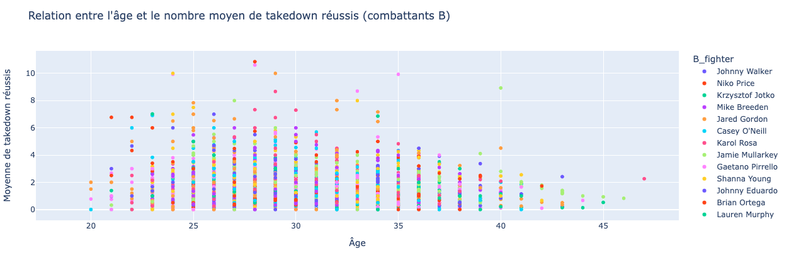


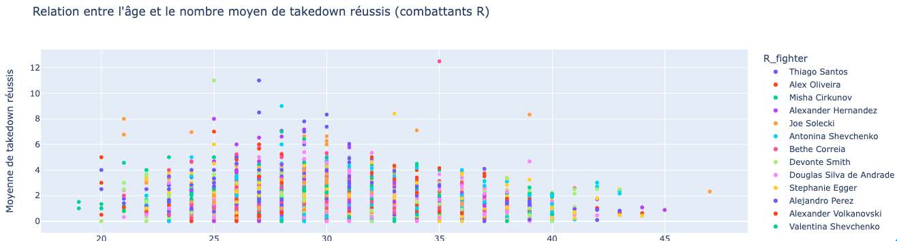


Observons que ce pic des performances pour chacun de ces paramètres peut être corrélé avec la notion du "prime" chez les sportifs. Il s'agit d'une période pendant laquelle le combattant est au meilleur de sa forme; rassemblant bonne forme physique et expérience requise.

Comme cela est souvent discuté on retrouve ainsi un pic physique entre 25 et 30 ans.Un chiffre.Un intervalle cohérent selon des professionels du domaine.

### Garde et Pourcentage de victoire :

Notons qu'un combattant peut adopter diverses gardes. 
On parle d'orthodoxe si le pied gauche est en avant, de southpaw si le droit est en avant, et de switch si le combattant est capable d'alterner à sa guise entre les deux sans que cela ne diminue ses performances.

La position orthodoxe, étant la position dite 'droitier', est celle le plus souvent utilisée par nos combattants.

Néanmoins, se retrouver face à un combattant "gaucher" est souvent qualifié de déstabilisant pour les autres. En minorité, un orthodoxe est très peu souvent confronté à ce type de disposition, même à l'entraînement. De plus, le foie n'étant pas placé au même endroit selon cette position, les enchaînements diffèrent. Ainsi, il devient important pour les combattants de s'adapter.


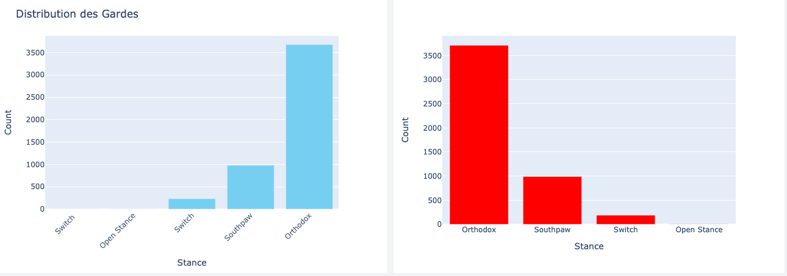

Ces deux histogrammes révèlent qu'il y a nettement plus de combattants Orthodoxes que de Southpaws, Switch ou Open Stance. 

On analyse alors la repartition des victoires entre les switchs, les orthodoxes et les southpaws pour chaque corner.


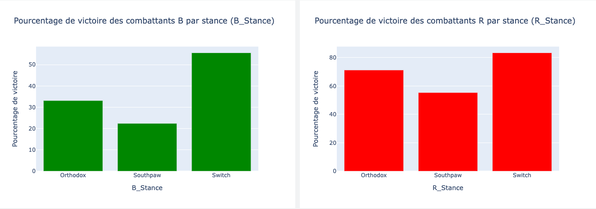

Cet histogramme représente le nombre de victoires des combattants du côté bleu (Blue side) et du côté rouge (Red side). Il est logique de constater que le Red side enregistre plus de victoires, car il inclut généralement les champions de chaque catégorie ainsi que les challengers principaux.

Le nombre limité de combattants utilisant les styles Switch rend difficile une étude approfondie sur cette variable. 


## Utilisation 

### Le FighterSearch : 


Le FighterSearch permet à l'utilisatieur d'obtenir les victoires, defaites et caractérisitques physiques de son combattant préferé en le choisissant en accedant au menu deroulant.

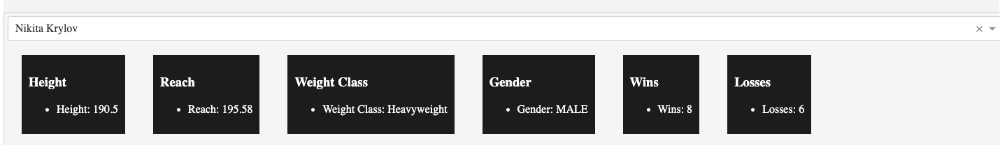

Par ailleurs, à travers la même opération il pourra accéder à la répartition des finissions du combattant, et cela : uniquement dans le cadre de ses victoires.

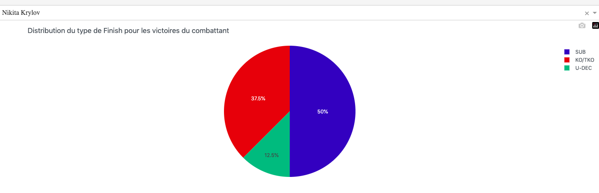

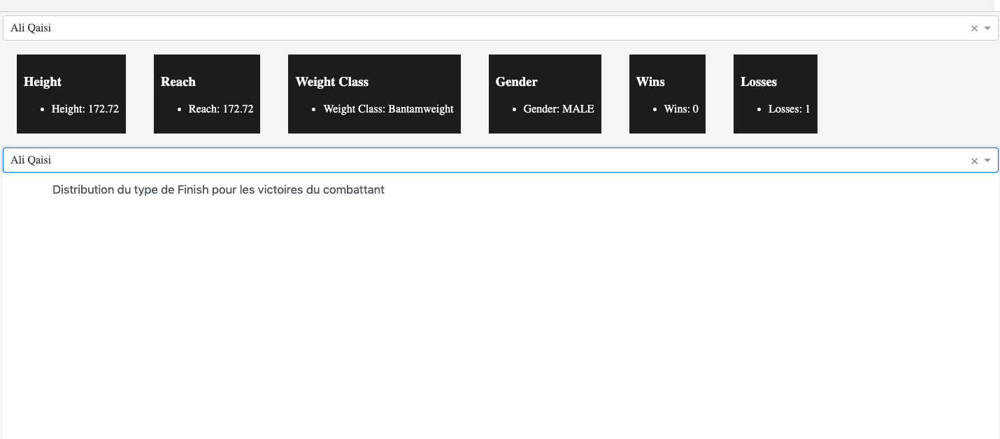


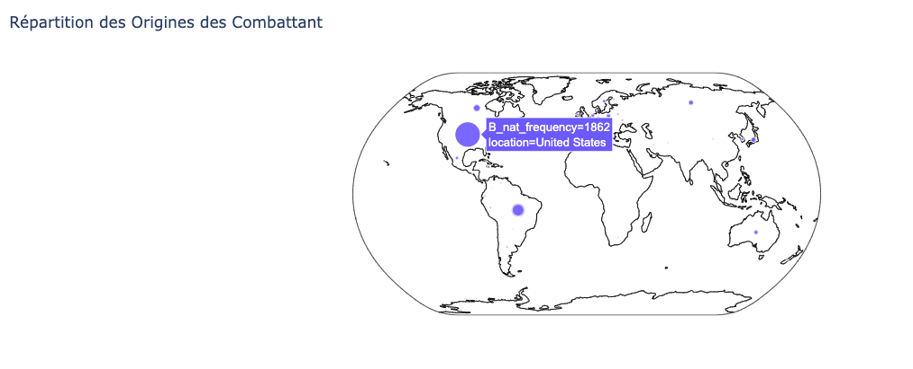

Si le combattant n'a aucune victoire à son actif, le graphique ne sera pas affiché.

En parlant du combattant, notons que le continent américain compte un nombre significativement plus élevé de combattants comparé aux autres continents. L'Amérique, étant l'un des précurseurs de ce sport de combat. En revanche, en Europe, ce sport a longtemps été interdit, ce qui pourrait expliquer la proportion relativement faible de combattants européens.

Par ailleurs, en seconde position viennent le Canada et le Brésil. Le Brésil, terre du jiu-jitsu brésilien, un sport central dans le MMA, peut expliquer la haute position du pays dans ce classement. Il en est de même pour la Russie, le sambo étant un sport national.

Cette carte illustre la répartition des combattants de MMA à travers les différents pays du monde.


## Scraping 

Le site ufc-stats.com ne comporte pas d'API.
Heureusement, le site web de l'ufc propose des images, des noms, des allonges , des poids ,des tailles et d'autres paramètres.On peut alors penser à scrape ces données. Différents framework sont disponibles comme Scrapy à titre d'exemple. 

Suite à la disposition du site de l'ufc : il s'agira de scrape : une page [évenement](http://ufcstats.com/statistics/events/completed) et une page [combattant](http://www.ufcstats.com/statistics/fighters). Puis de merge les dataframes obtenus.

Par exemple : 

Pour la page [combattant](http://www.ufcstats.com/statistics/fighters) il s'agira de génèrer des URLs pour chaque lettre de l'alphabet à partir de l'url initial. On crée ainsi des requêtes pour récupérer les liens vers les pages des combattants.

On analyse alors chaque page de la liste des combattants pour extraire les liens vers leurs pages individuelles .


On y extrait alors les variables d'intérêt.
On utiilisera par exemple des sélecteurs CSS et XPath pour extraire des données spécifiques des pages HTML.

Le même processus peut être effectué pour la page évenement : 
De la page : [évenement](http://ufcstats.com/statistics/events/completed),  on crée une requête pour récupérer les liens vers les pages d'événements de l'UFC.
On analyse chaque page d'événement pour extraire les liens vers les pages individuelles des matchs.
Puis l'on récupère : les détails de chaque match depuis sa page individuelle, tels que le nom du combat, la méthode de victoire, le round, le temps, les noms des combattants et d'autres statistiques.


## Aller plus loin
A partir des analyses faite précedemment, il devient intéressant  de chercher une corrélation entre la différence de reach, de taille et la probabilité de victoire.
Ici pour être sûr de cette analyse, le calcul d'une matrice de corrélation ou de simples coefficients de corrélation, peut être approprié.

Il devient aussi censé d'analyser l'évolution de la répartition des origines à travers les années. La ligue n'ayant cessé d'évoluer et comptant de plus en plus de combattants d'origines diverses.
Ainsi un pie chart interactif semblerait intéressant.

Une méthode d'executiion consisterai à calculer la fréquence des origines pour une date fixé.

Puis en faisant varier la date selon un curseur, il s'agira de rafraichir le pie chart selon les diverses valeurs temporelles dans notre dataframe.Par soucis de quantité de données le rafraichissement ne devrait être fait que pour des années entre 1-4 ans.

Le même raisonnement s'applique alors pour la répartition des lieux où se déroulent les combats UFC.

De plus, une analyse de la repartion des KOs selon les catégories de poids permettrait de confirmer l'adage fait par de nombreux adeptes de sports de combats selon lequel plus le poids est important plus la force de frappe l'est.
Ainsi l'on pourrait s'attendre tout comme pour la réparition de la moyenne du nombre de frappes significatives à avoir un nombre de KO plus important pour les catégories les plus lourdes.

La méthode d'execution de cette séquence pourrait se baser sur le calcul de la fréquence des KOs selon la colonne 'finish' pour chaque catégories de poids.

Il pourrait enfin s'agir de renvoyer un histogramme entre la dite fréquence et les catégories de poids.

Notons enfin qu'il serait valable visualiser les tendances de combat des combattants selon leurs origines. En effet, différentes origines impliquent diverses méthodes de combats, techniques et habitudes. Ainsi on pourrait analyser la prominence du takedown pour des combattants russes et américains, la lutte étant un sport dominant en ces territoires.

 Il en est de même pour l'ensemble des soumissions réussis.Le rear naked choke étant une soumission centrale en jiu jitsu brésilien.

De nombreuses options sont possibles ici. Une idée serait d'implémenter l'ensemble des moyennes de soumissions/takedown réussies sur une carte à l'aide de scatter_geo.

 Les bulles prendraient la taille et la couleur de la moyenne des soumissions/takedown réussis par territoires. D'autres variables pourraient aussi être intéréssant à analyser de cette manière telle que la moyenne des frappes significatives.


## Copyright

Je déclare sur l’honneur que le code fourni a été produit par moi/nous même, à l’exception des lignes ci dessous : 


Préparation des données pour les combattants bleus : Nous créons une nouvelle boîte appelée df_b avec seulement trois colonnes : 'weight_class', 'date', et 'B_avg_SIG_STR_pct'. Nous supprimons également toutes les lignes qui ont des valeurs manquantes. 

```bash
df_b = df[['weight_class', 'date', 'B_avg_SIG_STR_pct']].dropna()
df_b.columns = ['weight_class', 'date', 'avg_SIG_STR_pct']

```

Préparation des données pour les combattants rouges : Nous faisons la même chose que pour les combattants bleus.


``` bash 
df_r = df[['weight_class', 'date', 'R_avg_SIG_STR_pct']].dropna()
df_r.columns = ['weight_class', 'date', 'avg_SIG_STR_pct']

```
Calcul de la moyenne des coups significatifs par catégorie de poids : Nous calculons la moyenne des pourcentages de coups significatifs par catégorie de poids et stockons le résultat dans une nouvelle boîte appelée avg_by_weight_class.

``` bash
avg_by_weight_class = pd.DataFrame(joined_data.groupby(['weight_class']).mean()['avg_SIG_STR_pct'])

```
Ordonnancement des catégories de poids : Nous définissons un nouvel ordre pour les catégories de poids et réorganisons la boîte en conséquence.
```bash
new_order = ['Flyweight', 'Bantamweight', 'Featherweight', 'Lightweight', 'Welterweight', 'Middleweight', 'Light Heavyweight', 'Heavyweight', "Women's Strawweight", "Women's Flyweight", "Women's Bantamweight", "Women's Featherweight", 'Catch Weight'] 

avg_by_weight_class.index = pd.Categorical(avg_by_weight_class.

index, categories=new_order, ordered=True)


avg_by_weight_class = avg_by_weight_class.reindex(new_order)

avg_by_weight_class = avg_by_weight_class.drop('Catch Weight')


mens = avg_by_weight_class.loc[['Flyweight', 'Bantamweight', 'Featherweight', 'Lightweight', 'Welterweight', 'Middleweight', 'Light Heavyweight', 'Heavyweight']]
womens = avg_by_weight_class.loc[["Women's Strawweight", "Women's Flyweight", "Women's Bantamweight", "Women's Featherweight"]]


```
On se délaisse de la classe 'Catch Weight' : par définition il s'agit d'un poids intermédiaire entre deux catégories.En effet lorsqu'un combattant rate la pesé, l'adversaire ou l'organisation peuvent toujours décider de maintenir le combat.Ils se battent alors tout deux au poids "catchweight".

Il ne s'agit pas d'une vraie catégorie de poids.

On cherchait ensuite à comparer le nombre de finish moyen par round.
Pour cela, on fit appel à [Source2](https://www.kaggle.com/code/julianstadtherr/ufc-data-analysis-training)


Ce code crée une nouvelle liste, que nous appelons kos_by_round, en ne sélectionnant que les combats où le combattant a remporté le combat avec un "KO/TKO". 

Ensuite, il prend seulement deux informations de chaque combat, c'est-à-dire comment le combat s'est terminé ("finish") et dans quel round cela s'est produit ("finish_round").


```bash
kos_by_round = df[['finish', 'finish_round']].query('finish == "KO/TKO"')
```

Par ailleurs pour determiner la reparition des finitions : 
L'idée vient de ce [Site](https://www.kaggle.com/code/saheedosoba/saheed-ufc-project) .
```bash
finish_count = pd.DataFrame(df.finish.value_counts()).reset_index().rename(columns={'index': 'Type of Finish', 'finish': 'Frequency of Finish'})
frequency_finish_sum = finish_count['Frequency of Finish'].sum()
```

-df.finish.value_counts() compte combien de fois chaque type de finition apparaît dans la colonne "finish" du tableau de données.

-pd.DataFrame(...) transforme ces comptages en une nouvelle table (ou DataFrame) avec deux colonnes : une pour le type de finition ('Type of Finish') et une autre pour la fréquence de cette finition ('Frequency of Finish').

.reset_index() refaçonne l'index du tableau pour qu'il soit plus facile à utiliser.

.rename(columns={'index': 'Type of Finish', 'finish': 'Frequency of Finish'}) donne des noms plus clairs aux colonnes.

En résumé, cette partie du code crée un tableau qui montre combien de fois chaque type de finition apparaît dans nos combats. 

Frequency_finish_sum donne ainsi la somme totale de toutes ces fréquences. 
On compte alors combien de fois chaque finition spécifique a été utilisée dans tous les combats dans la liste.


Ce code crée une liste de liens hypertexte interactifs, chacun pointant vers une page spécifique de l'application Dash UFC. Ces liens sont ensuite inclus dans un div HTML pour les regrouper dans une section spécifique de notre interface utilisateur Dash.L'idée vient de ce [Site](https://dash.plotly.com/urls) .

```bash
html.Div([
            html.Div(
                dcc.Link(f"{page['name']} - {page['path']}", href=page["relative_path"])
            ) for page in dash.page_registry.values()
        ]),
```
```bash
if __name__ == '__main__':
    app.run_server(host='0.0.0.0', port=8007, debug=False)
```
Ce code est issu de [Stackoverflow](https://stackoverflow.com/questions/61890687/dash-app-refusing-to-start-127-0-0-1-refused-to-connect) .

if __name__ == '__main__': : Cette ligne vérifie si le script Python est exécuté en tant que programme principal (et non en tant que module importé dans un autre script). Si c'est le cas, le bloc d'instructions suivant sera exécuté.

app.run_server(host='0.0.0.0', port=8007, debug=False) : Ce bloc exécute le serveur web de l'application Dash. Les paramètres utilisés sont les suivants :

host='0.0.0.0' : Cela signifie que le serveur écoutera les connexions provenant de toutes les adresses IP disponibles.
port=8007 : Cela spécifie le numéro de port sur lequel le serveur écoutera les connexions entrantes. Dans ce cas, le port est défini sur 8007.
debug=False : Lorsque le mode débogage est désactivé (debug=False), l'application ne fournira pas des informations de débogage détaillées en cas d'erreurs. 

## Conclusion 
Cette première version de notre application Dash dédiée à l'UFC représente une première plongée dans le monde riche des arts martiaux mixtes. Cependant, comme toute initiative initiale, subsiste le potentiel d'amélioration et d'expansion.

L'inclusion des données sur l'âge des combattants, les détails sur les gardes, et les statistiques par catégorie de poids offre un aperçu intéressant dans l'univers complexe de l'UFC. Cependant, nous sommes pleinement conscients que cette application a encore beaucoup à offrir.

En espérant vous avoir communiqué notre passion pour les arts martiaux !
Merci pour votre lecture ! 

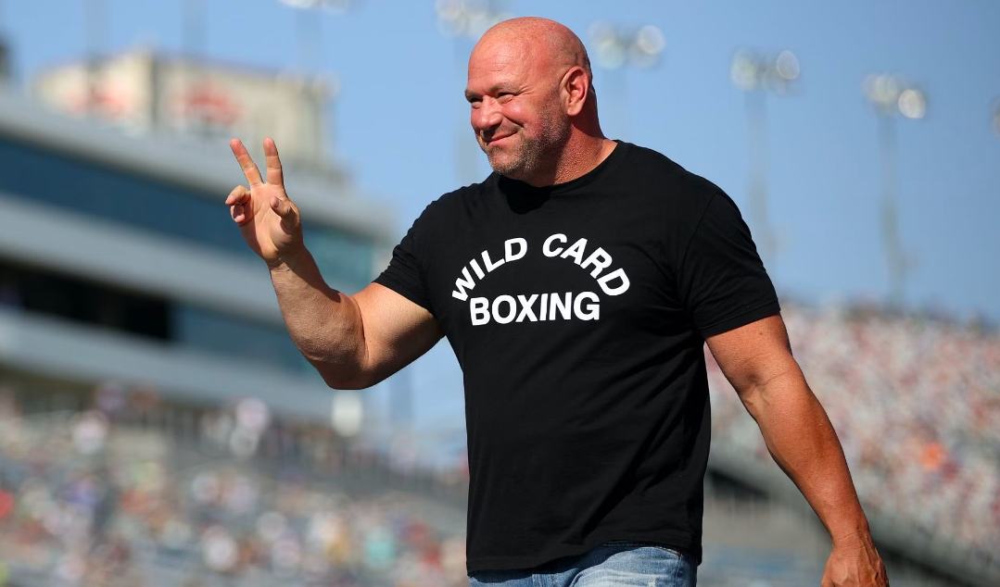

